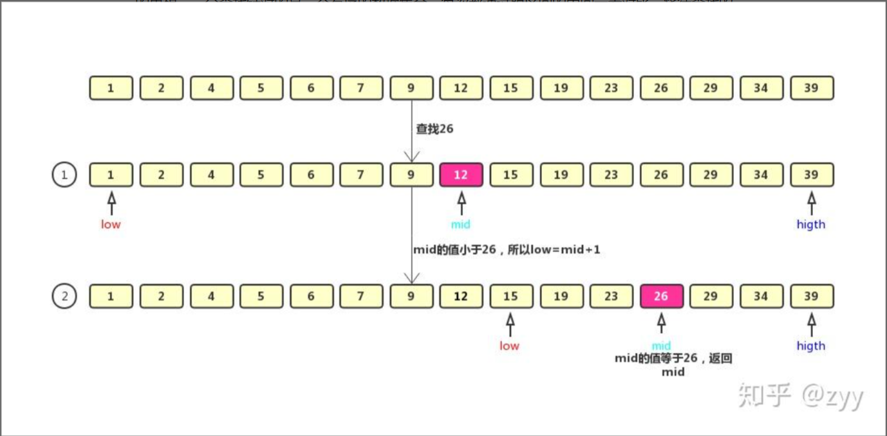

# 二分查找
[leetcode exercise](https://leetcode.cn/problems/binary-search/ "704 二分查找")  

## pre-acquisition
[reference](https://zhuanlan.zhihu.com/p/143879079 "reference")  

思路：针对**有序**的数列，每次和区间中间的元素对比，以缩小一半的查找空间，直到找到要查找的元素，或者区间被缩小为 0。

- 时间复杂度：O(logn)，效率高

### 局限：
#### 必须是有序的。
如果数据没有序，我们需要先排序，排序的时间复杂度最低是 O(nlogn)。所以，如果我们针对的是一组静态的数据，没有频繁地插入、删除，我们可以进行一次排序，多次二分查找。这样排序的成本可被均摊，二分查找的边际成本就会比较低。

但是，如果我们的数据集合有频繁的插入和删除操作，要想用二分查找，要么每次插入、删除操作之后保证数据仍然有序，要么在每次二分查找之前都先进行排序。

针对这种动态数据集合，无论哪种方法，维护有序的成本都是很高的。所以，**二分查找只能用在插入、删除操作不频繁，一次排序多次查找的场景中。针对动态变化的数据集合，二分查找将不再适用**。

#### 数据量太小，没有必要用
数据量小的时候，二分查找和遍历的时间区别不大。

#### 数据量太大，内存不足
底层依赖的是数组，数组需要的是一段连续的存储空间。数据量较大（e.g., 1GB），内存离散，无法提供足够的空间。

## 做题思路
可能要用二分法：
1. 数组为有序数组；
2. 题目还强调数组中无重复元素（重复元素导致输出下标不唯一）。
